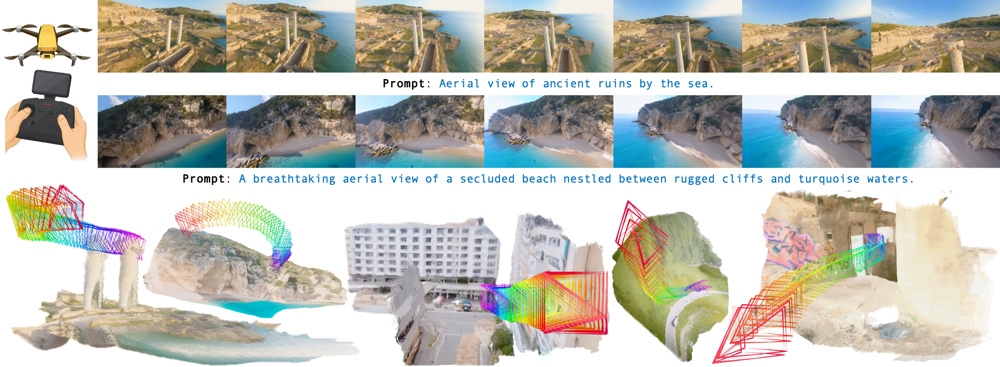
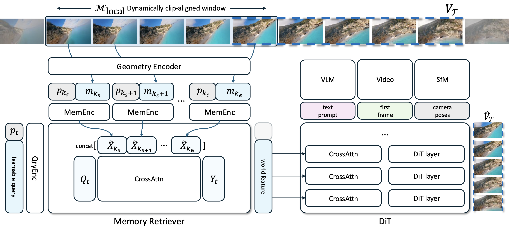

# Captain Safari: A World Engine with Pose-Aligned 3D Memory (CVPR 2026)

[](https://github.com/johnson111788/Captain-Safari/blob/main/LICENSE)
[](https://github.com/johnson111788/Captain-Safari/issues)
[](https://GitHub.com/johnson111788/Captain-Safari/pull/)
[](https://GitHub.com/johnson111788/Captain-Safari/commit/) 

Official implementation of **Captain Safari**, from the following paper

[Captain Safari: A World Engine with Pose-Aligned 3D Memory](https://johnson111788.github.io/open-safari/)<br/>
[Yu-Cheng Chou](https://sites.google.com/view/yu-cheng-chou), 
[Xingrui Wang](https://xingruiwang.github.io/), 
[Yitong Li†](https://openreview.net/profile?id=~Yitong_Li5), 
[Jiahao Wang](https://jiahaoplus.github.io/), 
[Hanting Liu](https://openreview.net/profile?id=~Hanting_Liu1), 
[Cihang Xie^](https://cihangxie.github.io/),
[Alan Yuille](https://www.cs.jhu.edu/~ayuille/), and 
[Junfei Xiao](https://lambert-x.github.io/)<br/>
Johns Hopkins University, †Tsinghua University, ^UC Santa Cruz<br/>
[[`arXiv`](https://arxiv.org/abs/2511.22815)] [[`Project Page`](https://johnson111788.github.io/open-safari/)] [[`Hugging Face`](https://huggingface.co/Johnson111788/Captain-Safari)]

<p align="center">
     <br />
    <em> 
    **Captain Safari** is a pose-aware world engine that generates long-horizon, 3D-consistent FPV videos from any user-specified camera trajectory. By retrieving pose-aligned world memory, it keeps geometry stable across large viewpoint changes and reconstructs crisp, well-formed structures while faithfully tracking aggressive 6-DoF motion.
    </em>
</p>

## OpenSafari: An Open-Source Pipeline for Camera-Annotated Video Data

To foster future research in camera-controllable and geometry-consistent video generation, we open-source **OpenSafari**, our comprehensive data curation pipeline. 

<p align="center">
     <br />
    <em> 
    **OpenSafari**. A multi-stage pipeline designed to stress-test geometry-consistent video generation by curating in-the-wild videos with rigorously verified camera trajectories.
    </em>
</p>

### Why OpenSafari?
Most existing datasets lack reliable camera poses or require expensive setups. OpenSafari provides an automated, scalable, and highly robust pipeline to transform arbitrary raw videos into high-quality, motion-rich training pairs. By using OpenSafari, you can easily build your own custom video dataset with camera trajectory annotations.

Our open-source toolkit includes out-of-the-box scripts for:
- 🛠️ **Parallel Preprocessing**: Highly efficient, resumable multi-GPU pipeline for video downloading, cropping, scene detection, watermark removal, and optical-flow motion filtering.
- 📷 **Progressive Trajectory Rebuild**: An automated loop combining Structure-from-Motion (SfM) with our custom verification/repair algorithms to fix tracking failures, ensure kinematic smoothness, and interpolate missing poses.
- ⚖️ **Trajectory Diversity Filtering**: A built-in filtering stage to balance the distribution of camera movements and prevent models from over-fitting to straightforward flight paths.
- 🧠 **VLM-based Filtering & Captioning**: Scripts leveraging Gemini and Qwen to semantically filter out invalid footage and generate dual-granularity text captions.

**We release our full pipeline as a foundation for future research**. Please check [./opensafari/README.md](./opensafari/README.md) for detailed instructions to run the pipeline!


## Captain Safari: A Memory-Conditioned World Engine

While current video diffusion models can generate high-fidelity clips, they struggle with **long-horizon 3D consistency** and **aggressive 6-DoF camera maneuvers**. Captain Safari bridges this gap by introducing a **Local World Memory** that anchors the generation process to a stable 3D scene representation.

<p align="center">
     <br />
    <em> 
    **Method overview.** Captain Safari builds a local world memory and, given a query camera pose, retrieves pose-aligned tokens that summarize the scene. These tokens then condition video generation along the user-specified trajectory, preserving a stable 3D layout.
    </em>
</p>

### Why Captain Safari?

Instead of relying purely on implicit clip-level attention, Captain Safari retrieves pose-aligned features from history and injects them into the DiT via dedicated Memory Cross-Attention. This allows the model to "remember" what the world looks like across huge viewpoint changes and sharp turns. 

Our open-source codebase provides a complete training and inference framework built upon DiffSynth-Studio:
- 🧠 **Pose-Conditioned Memory Retriever**: A novel module that learns to aggregate and predict 3D-aware world features based on target camera poses.
- ⚡ **Highly Efficient Pre-tokenization**: We provide a robust pre-encoding pipeline that caches Text, Video, and Image latents across multiple GPUs, **saving ~13GB VRAM** and accelerating training by 2-3x.
- 🚀 **Memory-Conditioned DiT**: Full implementation of our modified architecture that injects 3D priors directly into the denoising process for rock-solid spatial coherence.

**Build your own 3D-aware video generator today.** Please check [./captain_safari/README.md](./captain_safari/README.md) for detailed instructions on model training and inference.

## Citation

If you find this repository helpful, please consider citing:

```
@article{chou2025captain,
  title={Captain Safari: World Engine with Pose-Aligned 3D Memory},
  author={Chou, Yu-Cheng and Wang, Xingrui and Li, Yitong and Wang, Jiahao and Liu, Hanting and Xie, Cihang and Yuille, Alan and Xiao, Junfei},
  journal={arXiv preprint arXiv:2511.22815},
  year={2025}
}
```