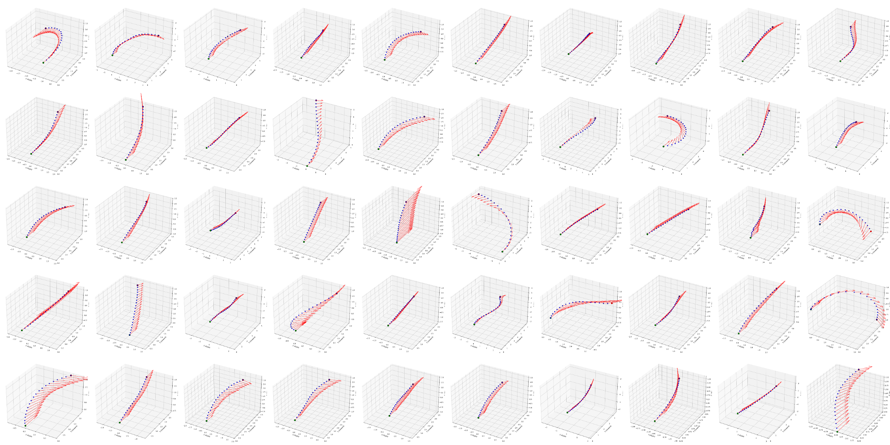

# OpenSafari: Data Download and Preprocessing

<p align="center">
     <br />
    <em> 
    **OpenSafari**. A multi-stage pipeline designed to stress-test geometry-consistent video generation by curating in-the-wild videos with rigorously verified camera trajectories.
    </em>
</p>

> *"Give a man a fish and you feed him for a day; teach a man to fish and you feed him for a lifetime. (授人以魚不如授人以漁)"*

## 1. Overview

We open source the full download and preprocessing code of our data curation pipline.
Our data curation pipeline systematically transforms arbitrary-long raw videos into well-structured, geometry-annotated training pairs. 

Specifically, raw footage is first processed into $T$-second source videos ($V$, default $15$ s), which are then decomposed into $5$ s clips ($V_\mathcal{T}$) alongside their corresponding camera trajectories ($p_{\mathcal{T}}$), local world memory features ($\mathcal{M}_{local}$), and captions for model training.

To implement the above process, we structure our pipeline into the following sequential steps:

- [**Sec. 3.1 Download and Preprocessing**](#31-download-and-preprocessing-pipeline): Scripts to fetch raw videos and perform initial heuristic filtering (e.g., watermark, motion) to obtain clean $T$-second source videos ($V$).
- [**Sec. 3.2 Model-based Filtering**](#32-model-based-filtering): Advanced semantic filtering using Vision-Language Models (Gemini/Qwen) to eliminate non-drone footage or subtle editing cuts.
- [**Sec. 3.3 Camera Trajectory Reconstruction**](#33-camera-trajectory-reconstruction): A progressive SfM pipeline to robustly reconstruct, verify, and repair the camera trajectories for the source videos.
- [**Sec. 3.4 StreamVGGT Inference**](#34-streamvggt-inference): Forward pass through the geometry encoder to extract 3D-aware memory tokens ($m_t$).
- [**Sec. 3.5 Local Memory Logic**](#35-local-memory-logic-data-splitting): Scripts to slide-window the $15$ s source video $V$ into multiple $5$ s target clips ($V_\mathcal{T}$), extract relative camera paths ($p_{\mathcal{T}}$), and sample the flexible historical memory context ($\mathcal{M}_{local}$).
- [**Sec. 3.6 Clip Captioning**](#36-clip-captioning): Dual-captioning strategy (detailed & brief) using VLMs to generate rich text conditions for each $5$ s clip.
- [**Sec. 3.7 Data Aggregation**](#37-data-aggregation-training-metadata-generation): Final step to aggregate all modalities (clips, poses, memory, text) into a single CSV index for the PyTorch DataLoader.
- [**Sec. 3.8 Trajectory Diversity Filtering**](#38-optional-but-helpful-trajectory-diversity-filtering): An optional filtering stage to balance the distribution of camera movements and prevent over-fitting to straightforward flight paths.

**We release our full pipeline as a foundation for future research and hope they can help support the broader community in building upon this effort**. If you are not following our settings (e.g., [StreamVGGT as geometry encoder](#34-streamvggt-inference), [local memory logic](#35-local-memory-logic-data-splitting)), you can simply follow [Sec. 3.1](#31-download-and-preprocessing-pipeline) to [Sec. 3.3](#33-camera-trajectory-reconstruction) to build your own high quality video dataset with carefully verified and repaired camera pose annotation. 

## 2. Installation

- Prerequisites: NVIDIA GPU with NVENC support, see [Video Encode and Decode GPU Support Matrix](https://developer.nvidia.com/video-encode-and-decode-gpu-support-matrix-new).

- Install FFmpeg for preprocessing. 
    - **If you have ffmpeg installed**, you can try the `ffmpeg -hwaccel cuda` command below to test the package. 
    - If not, easily install with the following command in a Conda environment:

```bash
ffmpeg -hwaccel cuda -i "YOUR_VIDEO-1080p.mp4" -vf "hwupload_cuda,fps=16,scale_cuda=-1:480" -c:v h264_nvenc -tune hq -cq 23 -c:a copy "YOUR_VIDEO-480p.mp4"
```
```bash
conda create -n opensafari python=3.10 -y && conda activate opensafari
conda config --add channels nvidia
conda config --add channels conda-forge
conda config --set channel_priority strict 
conda install ffmpeg
conda list
# You should see nvidia or conda-forge in the output Channel field instead of pkgs/main.
```

- Python 3.10 with dependencies:
```bash
pip install torch==2.1.2 torchvision==0.16.2 torchaudio==2.1.2 --index-url https://download.pytorch.org/whl/cu121
pip install pandas scipy transformers scenedetect opencv-python tqdm huggingface_hub gradio trimesh pygltflib
pip install 'numpy<2'
```

- [`hloc`](https://github.com/cvg/Hierarchical-Localization) install and the corresponding submodules:
```bash
git submodule update --init --recursive
cd opensafari && python -m pip install -e .
```

- Pre-trained model download:

```bash
wget https://dl.dropboxusercontent.com/s/4j4z58wuv8o0mfz/models.zip
unzip models.zip
```
## 3. Dataset Curation

## 3.1. Download and Preprocessing Pipeline

We provide a comprehensive, multi-stage pipeline script ([`1.download_preprocess.py`](1.download_preprocess.py)) to curate high-quality, motion-rich video from raw sources, as described in **Section 4.1** of our paper. The pipeline is designed to be **robust**, **resumable**, and **parallelized** across multiple GPUs.

To run the full pipeline:

```bash
python 1.download_preprocess.py \
  --video_csv videos.csv \
  --dataset_dir ./data \
  --gpu_ids 0,1,2,3,4,5,6,7 \
  --workers 96
```

### Pipeline Stages

The script processes videos through the following sequential stages:

1.  **Download**: Fetches videos from URLs, prioritizing high resolutions (4K/1080p) and verifying integrity.
2.  **Resize & Crop**: Normalizes videos to a standard resolution (default $1280 \times 720$) and frame rate (24 FPS). Automatically detects and crops black borders using `ffmpeg`'s `cropdetect`.
3.  **Scene Detection**: Utilizes `PySceneDetect` (Adaptive Detector) to identify scene boundaries and prevent cuts within a shot.
4.  **Hierarchical Splitting**:
    *   *Scene Split*: Cuts the raw video into variable-length scene vidoes.
    *   *Uniform Split*: Further divides long scenes into fixed-length vidoes (default $360$ frames / $15$ s) for training consistency.
5.  **Quality & Content Filtering**:
    *   **Watermark Detection**: Uses a SigLIP2-based model to detect and filter out vidoes with intrusive watermarks (threshold configurable).
    *   **Motion Analysis (RAFT)**: Computes optical flow to calculate the average motion magnitude, filtering out static or low-motion vidoes.
6.  **Finalization**: Eligible vidoes are assigned a unique UUID, moved to the final dataset directory, and logged in `meta.csv`.

### Key Arguments

| Argument | Default | Description |
| :--- | :--- | :--- |
| `--video_csv` | `videos.csv` | Path to the input CSV containing video URLs. **Must have an `mp4` column** containing direct download links (e.g., `https://example.com/video.mp4`). |
| `--dataset_dir` | `data` | Final output directory for verified vidoes. |
| `--workers` | `32` | Number of CPU workers for parallel processing. |
| `--gpu_ids` | `0,1,2,3` | Comma-separated list of GPU IDs for hardware acceleration (NVENC, RAFT). |
| `--video_frames` | `360` | Target number of frames per final vidoes (approx. 15s at 24 FPS). |
| `--height` / `--width` | `720` / `1280` | Target resolution for the resized videos. |
| `--scene_threshold` | `2.0` | Threshold for adaptive scene detection. |
| `--raft_threshold` | `5.0` | Minimum average motion score required to keep a vidoe. |
| `--watermark_threshold`| `0.1` | Maximum allowed watermark probability/ratio. |

## 3.2. Model-based Filtering

While the heuristic-based filtering in the previous step (watermark detection, motion analysis) is effective, it may still leave some edge cases (e.g., non-drone footage, subtle editing cuts, or low-quality videos). To ensure the highest dataset quality, we recommend a second pass using a Vision-Language Model (VLM) for semantic filtering.

We provide two options:

1.  **Gemini (Recommended)**: If you have access to free Gemini API tokens, we highly recommend using [Gemini](2.gemini_filtering.py). It generally offers superior filtering performance and better instruction following for detecting specific issues like "non-drone footage" or "abrupt motion".

```bash
# Requires GEMINI_API_KEY in the script or environment
python 2.gemini_filtering.py \
  --directory ./data \
  --output filters.csv \
  --workers 4
```

2.  **Qwen (Local Alternative)**: If API access is limited, you can use the [local Qwen2.5-VL-7B-Instruct model](2.qwen_filtering.py). It serves as a strong open-source alternative for filtering.

```bash
python 2.qwen_filtering.py \
  --directory ./data \
  --output filters.csv \
  --num-gpus 8 \
  --batch-size 4
```

The scripts will generate a CSV file with tags (e.g., `[Not drone]`, `[Watermark]`) for invalid videos, or `Valid` for clean ones. Given the generated `filters.csv`, you should filter the `./data` accordingly.

## 3.3. Camera Trajectory Reconstruction

To obtain reliable camera trajectories for the `OpenSafari` dataset, we employ a rigorous **Progressive Rebuild Pipeline**. This pipeline not only reconstructs the camera poses using Structure-from-Motion (SfM) but also iteratively verifies and repairs the trajectories to ensure geometric consistency and kinematic smoothness, as described in **Section 4.2** of our paper.

### 3.3.1. Frame Sampling

First, we sample frames from the preprocessed video at a fixed frame rate (default: 4 FPS) to prepare for SfM.

```bash
python 3.1.video_frame_sampler.py \
  --input_path ./data \
  --output ./data-frames_4fps \
  --fps 4 \
  --max-workers 32
```

### 3.3.2. Progressive Reconstruction & Repair

We provide a unified script [`3.2.camera_reconstruction.py`](3.2.camera_reconstruction.py) that automates the entire reconstruction and verification loop. It iteratively performs the following steps until convergence or maximum iterations are reached:

1.  **SfM Reconstruction**: Uses [`hloc`](https://github.com/cvg/Hierarchical-Localization) (Hierarchical Localization) with `ALIKED` and `LightGlue` to reconstruct the scene via [`3.2.1.reconstruction.py`](3.2.1.reconstruction.py).
2.  **Model Selection**: Automatically selects the best reconstruction model (most registered images) from COLMAP outputs via [`3.2.2.fix_model_selection.py`](3.2.2.fix_model_selection.py) since hloc sometime fails to do so.
3.  **Format Conversion**: Converts HLoc/COLMAP outputs to the VGGT format (Numpy arrays) via [`3.2.3.convert_hloc_to_vggt_format.py`](3.2.3.convert_hloc_to_vggt_format.py).
4.  **Verification & Repair**: Uses [`3.2.4.verify_and_repair.py`](3.2.4.verify_and_repair.py) to perform:
    *   **Database Check**: Filters unreliable transitions based on inlier counts.
    *   **Geometric Check**: Re-verifies epipolar geometry using stored keypoints.
    *   **Kinematics Check**: Detects translation spikes, rotation jumps, and orientation flips.
    *   **Repair**: Linearly interpolates and SLERPs to fix sparse bad transitions.

```bash
# Run the progressive pipeline (Reconstruct -> Verify -> Repair -> Loop)
python 3.2.camera_reconstruction.py \
  --data-base-path   ./data-frames_4fps \
  --outputs-dir      ./data-frames_4fps-hloc \
  --camera-dir       ./data-frames_4fps-camera \
  --camera-fixed-dir ./data-frames_4fps-camera-fixed \
  --num-gpus 8 \
  --processes-per-gpu 5 \
  --max-iterations 2
```

### 3.3.3 Coordinate Normalization

We convert the reconstructed global camera poses into a local coordinate system where the first frame is at the origin $(0,0,0)$ with an identity rotation. This is crucial for training [Wan2.2-Fun-5B-Control-Camera](https://huggingface.co/alibaba-pai/Wan2.2-Fun-5B-Control-Camera), a pose-conditioned models.

```bash
python 3.3.convert_to_local_coords.py \
  --input-dir ./data-frames_4fps-camera-fixed \
  --output-dir ./data-frames_4fps-camera-fixed-local
```

### 3.3.4. Interpolate Missing Cameras

In some cases, the SfM reconstruction might fail to register a few frames. To ensure that every single frame has a corresponding camera pose for downstream modeling, we provide an interpolation script with SLERP for rotations and linear interpolation for translations.

```bash
python 3.4.interpolate_camera.py \
  --input-dir ./data-frames_4fps-camera-fixed-local \
  --output-dir ./data-frames_4fps-camera-fixed-local-interpolated \
  --target-frames 60
```

### 3.3.5. Visualize Camera Trajectory

To inspect the quality of the interpolated and local camera trajectories, we provide a visualization script. It renders 3D plots showing camera positions and orientations for each video.

```bash
python 3.5.viz_camera.py \
  --input-dir ./data-frames_4fps-camera-fixed-local-interpolated
```

<p align="center">
     <br />
    <em> 
    **Trajectories Visualization**. Example of camera poses extracted from the videos, showing diverse and accurate reconstruction for each video. The red arrows in camera trajectory denote view directions.
    </em>
</p>

## 3.4. StreamVGGT Inference

We use [StreamVGGT](https://github.com/wzzheng/StreamVGGT) to extract 3D-aware memory features from the video. These features are then pose-indexed and serve as the "world memory" in Captain Safari, as described in **Section 3.1** of the paper.we

We provide a script [`4.streamvggt.py`](4.streamvggt.py) to run StreamVGGT in inference mode and export the memory tokens.

```bash
python 4.streamvggt.py \
    --mode export_memory \
    --video_root ./data \
    --output ./data-streamvggt \
    --fps_interval 0.25
```

This script will:
1.  Sample frames from videos at 4 FPS (interval 0.25s).
2.  Run the StreamVGGT model to predict 3D points, depth, and camera poses.
3.  Export the **aggregated memory tokens** (`*_aggregated_tokens.npy`) and point cloud features (`*_pts3d_features.npy`).
4.  Also save the predicted point clouds (`*_pointcloud.npy`) and camera parameters (`*_in/extrinsic.npy`) for visualization/debugging.

The extracted aggregated memory tokens ($`m_t`$) will be used by the memory retriever during video generation.

## 3.5. Local Memory Logic (Data Splitting)

As described in **Section 3.1** and **5.1** of our paper, our model learns to retrieve "World Memory" by conditioning on a query pose. To train the models, we need to decompose our continuous $T=15$ s source video $V$ into specific components for training:

1. **Video Clip ($V_\mathcal{T}$)**: The $5$ s video clip to be generated, with time interval $\mathcal{T} = [t_0, t_1]$.
2. **Camera Trajectory ($p_\mathcal{T}$)**: The $5$ s relative camera path corresponding to $\mathcal{T}$, converted to local coordinates (setting the pose at $t_0$ as the origin).
3. **Query Condition ($p_{t_1}$ & $m_{t_1}$)**: The terminal camera pose $p_{t_1}$ at the end of the clip, and its corresponding memory token $m_{t_1}$ (used as the ground truth target to warm up the Retriever).
4. **Local Memory Context ($\mathcal{M}_{local}$ & $p_\tau$)**: A pool of historical feature slices that acts as the context library for the Retriever. Each slice has a length of $L \in [1, 5]$ seconds, bounded by a dynamic memory window $[k_s, k_e]$ defined in the paper:
   - Starts at most $L$ seconds before the clip entrance $t_0$: $t_0 - L \le k_s \le t_0$
   - Duration is at most $L$ and overlaps with the generation interval: $\max(k_s, t_0)+1 \le k_e \le \min(k_s+L, t_1)$
   
   *Here is a visual representation of how the memory slices are generated relative to the target video clip:*
   ```text
   Source Video (15s): |----.----.----.----.----.----.----.----.----.----.----//----|
   Time (s):           0    1    2    3    4    5    6    7    8    9    10   ...   15
                                           [========================]
                                            Target Clip (t_0=4, t_1=9)
                                           ^                        ^
                                          t_0                      t_1
                                                                    ^ Query Pose (p_{t1})
   
   Possible Local Memory Contexts [k_s, k_e] for this target clip (t_0=4):
   - Starts at t_0 (k_s = 4):
                                           [====] (1s)
                                           [====.====] (2s)
                                           ...
                                           [====.====.====.====.====] (5s)
   - Starts before t_0 (e.g. k_s=2):
                                 [====.====.====] (3s)
                                 [====.====.====.====] (4s)
                                 [====.====.====.====.====] (5s)
   (Note: Slices cannot exceed length L=5s and must end before t_1)
   ```

We provide three scripts to pre-process these combinations efficiently:

### 3.5.1 Video Clips ($V_\mathcal{T}$)
We split each $15$ s source video into $11$ overlapping $5$ s clips ($\mathcal{T}$) with a $1$ s sliding window (stride).

```bash
python 5.1.process_video.py \
  --input-dir ./data \
  --output-dir ./data-slices \
  --num-processes 20
```

### 3.5.2 Camera Poses ($p_{\mathcal{T}}$ & $p_{t_1}$ & $p_\tau$)
This script processes the full $60$-frame ($15$ s @ $4$ fps) camera parameters (`extrinsic.npy`, `intrinsic.npy`). In a single run, it:
- Extracts the $11$ target camera trajectories corresponding to each interval $\mathcal{T}$ (and transforms extrinsics to local coordinates).
- Extracts the terminal query pose $p_{t_1}$ for each clip.
- Generates all possible valid context slices for the Local Memory library $\mathcal{M}_{local}$.

```bash
python 5.2.process_camera.py \
  --input-dir ./data-frames_4fps-camera-fixed-local-interpolated \
  --output-dir ./data-frames_4fps-camera-fixed-local-interpolated-slices \
  --num-processes 20
```

### 3.5.3 Memory Slices ($m_{t_1}$ & $\mathcal{M}_{local}$)
Similar to the camera script, this script processes the $60$-frame StreamVGGT features (`aggregated_tokens.npy`). It extracts the terminal query memory tokens ($m_{t_1}$, ground truth for the Retriever loss) and generates all possible historical feature slices for $\mathcal{M}_{local}$.

```bash
python 5.3.process_memory.py \
  --input-dir ./data-streamvggt \
  --output-dir ./data-streamvggt-slices \
  --num-processes 20
```


## 3.6. Clip Captioning

To ensure a diverse distribution of text descriptions for training, we employ a dual-captioning strategy that generates both [long, detailed captions](./6.gemini_captioning.py) and [short, concise summaries](./6.qwen_short_captioning.py).

1.  **Long-Detailed Captioning (Gemini)**:
    We use the **Gemini 2.5 Flash** model to generate comprehensive descriptions. The script will describes the camera movement, environment, and lighting in detail.

```bash
# Requires GEMINI_API_KEY in the script or environment
python 6.gemini_captioning.py \
  --directory ./data-slices \
  --output long_captions.csv \
  --workers 4
```

2.  **Short-Brief Captioning (Qwen)**:
    We use the local **Qwen2.5-VL-7B-Instruct** model to generate brief, one-sentence captions that capture the essence of the scene. This script supports multi-GPU parallel inference.

```bash
python 6.qwen_short_captioning.py \
  --directory ./data-slices \
  --output short_captions.csv \
  --num-gpus 8 \
  --batch-size 4
```

## 3.7. Data Aggregation (Training Metadata Generation)

After generating all the modalities (clips, camera poses, memory slices, and text captions), we need to aggregate them into a unified dataset index (CSV) for the PyTorch DataLoader.

The script randomly samples a valid memory slice $[k_s, k_e]$ from the generated pool for each video clip $\mathcal{T}$. This ensures the model learns to retrieve information from history contexts of varying lengths and temporal offsets.

Furthermore, to ensure text conditioning diversity, the script mixes the short and long captions based on a specified ratio (e.g., 50% long, 50% short).

```bash
python 7.aggregate_metadata.py \
  --output-csv metadata.csv \
  --short-captions short_captions.csv \
  --long-captions long_captions.csv \
  --video-dir ./data-slices \
  --memory-dir ./data-streamvggt-slices \
  --camera-dir ./data-frames_4fps-camera-fixed-local-interpolated-slices \
  --mix-ratio 0.5
```

## 3.8. (Optional but helpful) Trajectory Diversity Filtering

To ensure a balanced distribution of camera movements and prevent the model from over-fitting to straight flight paths, we provide a script to filter trajectories based on angle changes. It computes the forward direction vectors, bins the angle changes, and performs uniform sampling across different motion intensities.

```bash
python 8.filter_camera.py \
  --input-csv metadata.csv \
  --output-csv metadata.filtered.csv
```


## 4. Citation


If you find this repository helpful, please consider citing:

```
@article{chou2025captain,
  title={Captain Safari: World Engine with Pose-Aligned 3D Memory},
  author={Chou, Yu-Cheng and Wang, Xingrui and Li, Yitong and Wang, Jiahao and Liu, Hanting and Xie, Cihang and Yuille, Alan and Xiao, Junfei},
  journal={arXiv preprint arXiv:2511.22815},
  year={2025}
}
```